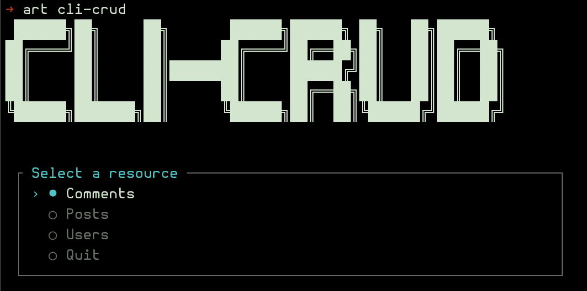
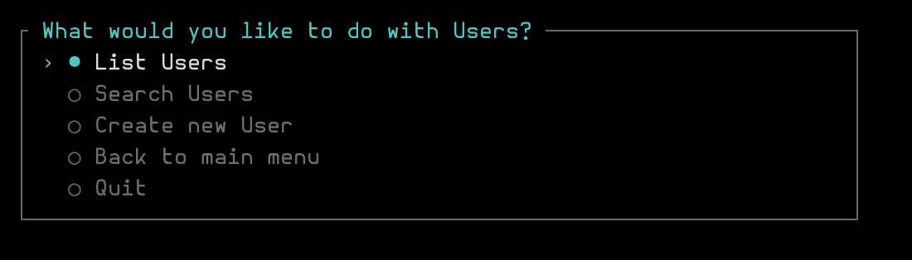
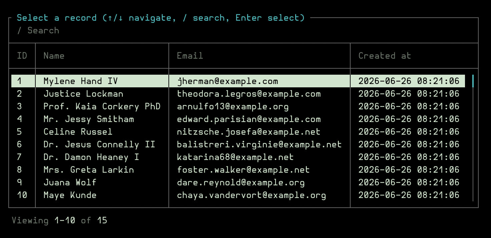
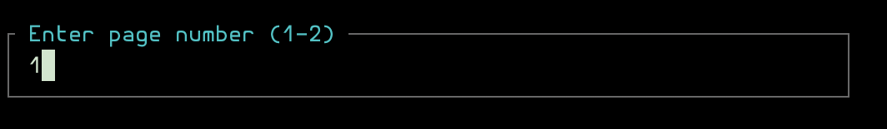
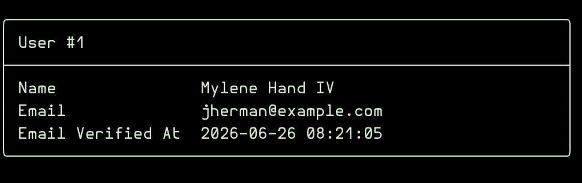
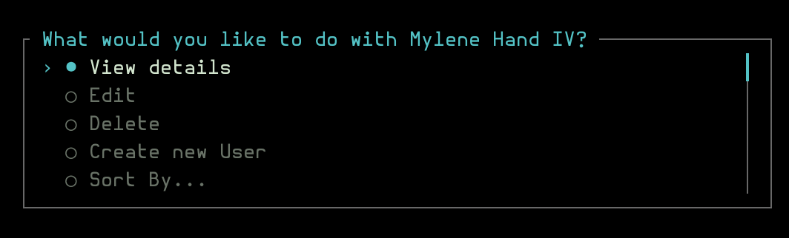
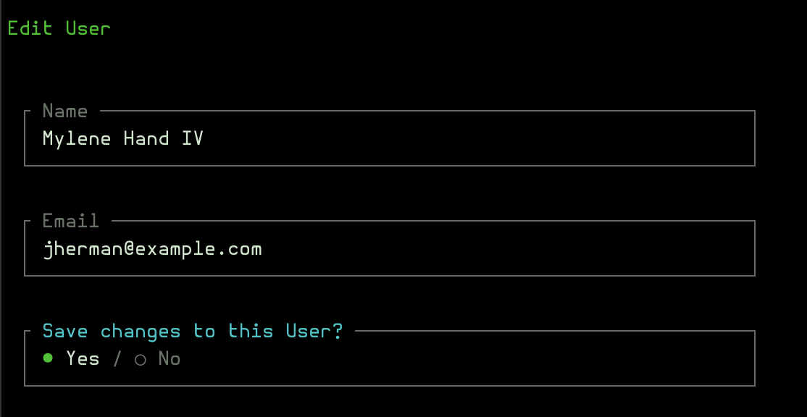

# repat/cli-crud

[](https://packagist.org/packages/repat/cli-crud)
[](https://packagist.org/packages/repat/cli-crud)
[](https://github.com/repat/cli-crud/actions/workflows/tests.yml)
[](https://styleci.io/repos/1266185185)
[](https://packagist.org/packages/repat/cli-crud)
[](https://packagist.org/packages/repat/cli-crud)



A **CLI CRUD admin panel** for Laravel, inspired by [Filament](https://filamentphp.com/) and [Laravel Nova](http://nova.laravel.com/). Built with [`laravel/prompts`](https://laravel.com/docs/13.x/prompts) and [`nunomaduro/termwind`](https://github.com/nunomaduro/termwind).

## Requirements

- PHP ^8.4
- Laravel 12.x | 13.x

## Installation

```bash
composer require repat/cli-crud
```

The service provider will be automatically registered.

## Configuration

Publish the configuration file:

```bash
php artisan vendor:publish --tag=cli-crud-config
```

This will create `config/cli-crud.php`:

```php
return [
    'resources' => [
        'path' => app_path('CliCrud/Resources'),
        'namespace' => 'App\\CliCrud\\Resources',
    ],
    'actions' => [
        'path' => app_path('CliCrud/Actions'),
        'namespace' => 'App\\CliCrud\\Actions',
    ],
    'pagination' => [
        'per_page' => 15,
        'relation_per_page' => 10,
    ],
    'authorization' => [
        'enabled' => false,
    ],
];
```

## Usage

### Running the CLI

```bash
php artisan cli-crud
```

This opens an interactive menu where you can:

- Select a resource (Model)
- List records (paginated)
- Search for records
- View record details
- Create new records
- Delete records (soft delete, force delete, restore)
- Run an action for (a) record(s)
- View custom cards & charts for metrics
- View images ([kitty](https://sw.kovidgoyal.net/kitty/) and [iTerm](https://iterm2.com/documentation-images.html) protocol)

## Screenshots

<a href="img/resource-selection-screen.png"></a>

<a href="img/list-screen.png"></a>

<a href="img/pagination-screen.png"></a>

<a href="img/detail-screen.png"></a>

<a href="img/detail-selection-screen.png"></a>

<a href="img/edit-screen.png"></a>

## Resources

See [docs/RESOURCES.md](docs/RESOURCES.md) for creating resources, the generated structure, auto-generated fields from a model, and available properties.

## Fields

See [docs/FIELDS.md](docs/FIELDS.md) for all field types, relations, and options.

## Search

See [docs/SEARCH.md](docs/SEARCH.md) for declaring searchable fields, the `$search` override, and custom search engine integration.

## Actions

See [docs/ACTIONS.md](docs/ACTIONS.md) for creating and attaching Nova-style actions, including queued and destructive variants.

## Cards

See [docs/CARDS.md](docs/CARDS.md) for Chart, Image and Custom cards in the detail view.

## Authorization

See [docs/AUTHORIZATION.md](docs/AUTHORIZATION.md) for enabling Laravel Gates/Policies integration.

## Roadmap

- Dashboards
- Action log (audit trail)
- Plugins
- Export (CSV, JSON)
- TUI testing
- Code Cleanup

## Testing

```bash
composer test
```

## License

MIT
