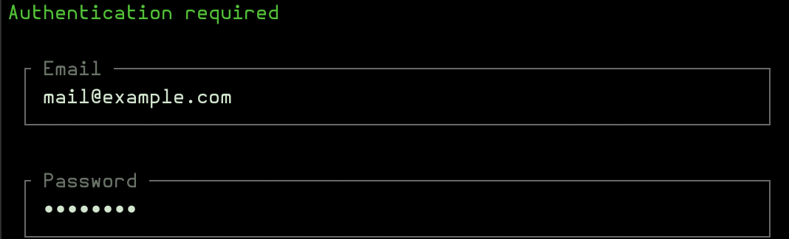

# Authorization

The package integrates with Laravel's Gates and Policies. Authorization is **disabled by default** since this is a CLI tool.

To enable authorization, update `config/cli-crud.php`:

```php
'authorization' => [
    'enabled' => true,
],
```

When enabled, the package checks:

- `viewAny` - Can view the resource list
- `view` - Can view a specific record
- `create` - Can create new records
- `delete` - Can delete records
- `forceDelete` - Can permanently delete soft-deleted records
- `restore` - Can restore soft-deleted records

**Note:** If no user is authenticated (typical in CLI), all actions are allowed regardless of policy settings.

If no policy exists for a model, all actions are allowed by default.

When the authorization is enabled in the config, this login screen will appear:

<a href="../img/authentication.png"></a>

[← Back to README](../README.md)
