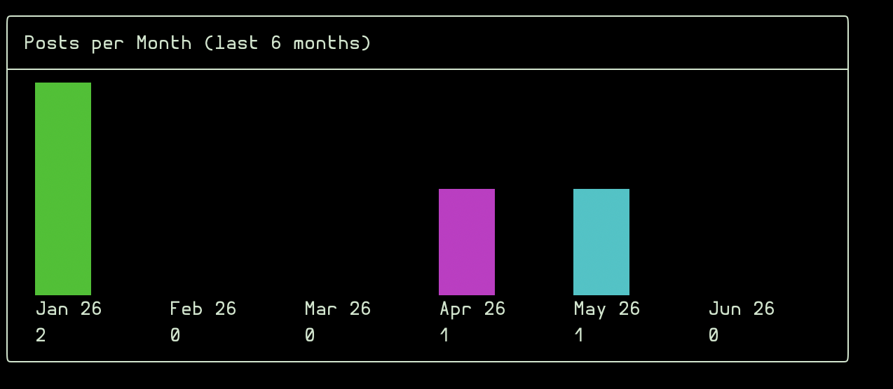
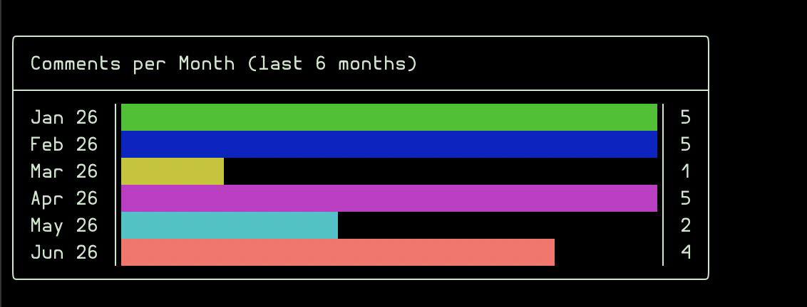

# Cards

Cards are supplementary panels displayed in the detail view, either before or after the relation tables. Three card types are available via static factory methods on the base `Card` class.

All card closures receive `(Model $model, Resource $resource)` and are called once per detail view render.

## Different Type Cards

### Custom Card

<a href="../img/custom-dashboard.png"></a>

Displays arbitrary content (single value or multi-line) in a box. The closure should return a string, number, or PHP enum.

```php
use Repat\CliCrud\Cards\Card;

public static function cards(): array
{
    return [
        Card::custom('Total Orders', fn ($model, $resource) => $model->orders()->count()),
    ];
}
```

Multi-line content is supported via newlines in the returned string:

```php
use Repat\CliCrud\Cards\Card;

public static function cards(): array
{
    return [
        Card::custom('Server Info', function ($model, $resource) {
            $host = gethostname();
            $date = now()->toDateTimeString();
            return "Host: {$host}\nDate: {$date}";
        }),
    ];
}
```

### Chart Card

<a href="../img/bar-chart-dashboard.png"></a>

Renders an ASCII bar or horizontal bar chart. The closure must return an associative array of `['label' => value, …]`.

```php
use Repat\CliCrud\Cards\Card;

public static function cards(): array
{
    return [
        Card::chart('Orders per Month', function ($model, $resource) {
            return [
                'Jan' => 42, 'Feb' => 38, 'Mar' => 55,
                'Apr' => 61, 'May' => 48,
            ];
        }),
    ],
}
```

Chart types: `bar()` (default), `horizontalBar()`, `scatter()`.

<a href="../img/horizontal-bar-chart-dashboard.png"></a>

To show percentages of the total instead of raw values, chain `->percentage()`:

```php
Card::chart('Orders per Month', fn ($model, $resource) => [
    'Jan' => 42, 'Feb' => 38, 'Mar' => 55, 'Apr' => 61, 'May' => 48,
])->bar()->percentage(),
```

### Scatter Chart

Plots `[x, y]` coordinate pairs on a 2D grid. The closure must return an associative array where each key is a label and each value is a `[x, y]` array.

```php
Card::chart('Temperature vs Sales', function ($model, $resource) {
    return [
        'Jan' => [10, 200], 'Feb' => [15, 150], 'Mar' => [20, 300],
        'Apr' => [22, 350], 'May' => [25, 400],
    ];
})->scatter(),
```

### Image Card

Displays an image using terminal graphics protocols inside a titled box. The closure should return a local file path or URL.

Supported protocols (auto-detected by default):

- **Kitty** ([graphics protocol](https://sw.kovidgoyal.net/kitty/graphics-protocol/)) — auto-detected on Kitty/WezTerm, also the fallback
- **iTerm2** ([inline images protocol](https://iterm2.com/documentation-images.html)) — auto-detected on iTerm2

```php
Card::image('Photo', fn ($model, $resource) => storage_path('app/photos/'.$model->photo)),

// Force Kitty protocol
Card::image('Logo', fn () => public_path('logo.png'))->kitty(),

// Force iTerm2 protocol
Card::image('Screenshot', fn () => public_path('screenshot.png'))->iterm(),
```

When the image can't be loaded (file not found, unsupported format), a fallback message is shown in the same titled box.

<a href="../img/image-dashboard.png"></a>

## Position

Cards render after relations by default. Use `->before()` to render them before relations (between the field values and the relation tables).

```php
Card::custom('Quick Stats', fn ($m, $r) => '…')->before(),
```

## Multiple cards

Return multiple cards from `cards()` — they are rendered in the order returned.

```php
public static function cards(): array
{
    return [
        Card::custom('Posts', fn ($m, $r) => $m->posts()->count()),
        Card::chart('Views per Day', fn ($m, $r) => [
            'Mon' => $m->views()->whereDay('created_at', 1)->count(),
        ])->horizontalBar(),
    ];
}
```

[← Back to README](../README.md)
