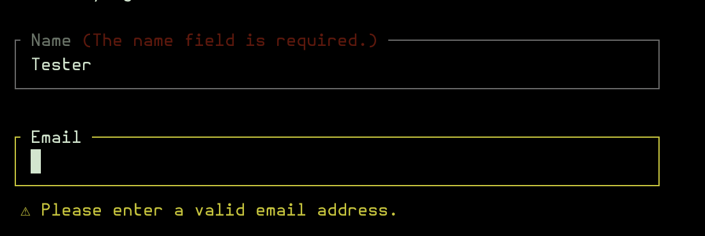

# Field Types

All field types use the signature `Field::make(string $label, ?string $name = null)` where `$label` is the display name and `$name` is the optional database column name. If `$name` is omitted, it will be automatically derived from the label (e.g., `'First Name'` → `'first_name'`, `'firstName'` → `'first_name'`).

## Common Methods

These methods are available on every field type:

- `->required()` — Field must be filled in
- `->nullable()` — Field may be left empty (stores `null`)
- `->default(mixed $value)` — Default value when creating
- `->rules(array $rules)` — Custom Laravel validation rules
- `->searchable()` — Include in the list-view search (see [SEARCH.md](SEARCH.md))
- `->notInForms()` — Exclude from create and edit forms (useful for auto-managed columns like `created_at`)

## Scalar Fields

- `Text::make('Name')` or `Text::make('Name', 'name')` — Text input
  - `->email()` — Email validation
  - `->password()` — Mask input (for password fields)
  - `->required()`, `->nullable()`, `->default()`, `->rules()`

- `Number::make('Age')` or `Number::make('Age', 'age')` — Numeric input
  - `->float()` — Allow decimal values
  - `->required()`, `->nullable()`, `->default()`, `->rules()`

- `Boolean::make('Is Active')` or `Boolean::make('Is Active', 'is_active')` — Yes/No confirmation
  - `->default(true)`, `->rules()`

- `DateTime::make('Created At')` or `DateTime::make('Created At', 'created_at')` — Date/time input
  - `->format('Y-m-d H:i:s')` — Custom format
  - `->required()`, `->nullable()`, `->default()`, `->rules()`

- `Select::make('Status')` or `Select::make('Status', 'status')` — Dropdown selection
  - `->options(['active' => 'Active', 'inactive' => 'Inactive'])`
  - `->required()`, `->nullable()`, `->default()`, `->rules()`

- `Textarea::make('Content')` or `Textarea::make('Content', 'content')` — Multi-line text input
  - `->markdown()` — Render content as Markdown in the detail view (requires `league/commonmark`)
  - `->required()`, `->nullable()`, `->default()`, `->rules()`

- `Json::make('Config')` or `Json::make('Config', 'config')` — JSON textarea input
  - `->highlight(bool)` — Toggle ANSI syntax highlighting in the detail view (default: `true`)
  - Validated as valid JSON on input
  - `->required()`, `->nullable()`, `->default()`, `->rules()`

## Relations

All relation types use the signature `Relation::make(string $label, string $resourceClass)` or `Relation::make(string $label, string $name, string $resourceClass)` where `$label` is the display name, `$name` is the optional relationship method name on the model, and `$resourceClass` is the related resource class. If `$name` is omitted, it will be automatically derived from the label.

### Fillable (appear in create/edit forms)

- `BelongsTo::make('User', UserResource::class)` or `BelongsTo::make('User', 'user', UserResource::class)` — Belongs to relationship
  - `->displayField('name')` — Column used to display/search options
  - `->required()` — Require a selection (default: optional with a "— None —" option)
  - Uses inline search for large datasets

- `MorphTo::make('Commentable', 'commentable', [PostResource::class])` — Polymorphic BelongsTo
  - `->displayField('title')` — Column used to display/search options
  - `->resources([…])` — Acceptable target resource classes
  - `->required()` — Require a selection

### Inline (displayed in the main detail box)

- `HasOne::make('Profile', ProfileResource::class)` or `HasOne::make('Profile', 'profile', ProfileResource::class)` — Has one relationship
  - Displayed inline in the detail view

- `MorphOne::make('Profile', ProfileResource::class)` or `MorphOne::make('Profile', 'profile', ProfileResource::class)` — Polymorphic Has one relationship
  - Displayed inline in the detail view

### Tabular (displayed as paginated sub-tables below the main box)

- `HasMany::make('Posts', PostResource::class)` or `HasMany::make('Posts', 'posts', PostResource::class)` — Has many relationship
  - Displayed as a paginated sub-table in the detail view

- `HasManyThrough::make('Posts', PostResource::class)` or `HasManyThrough::make('Posts', 'posts', PostResource::class)` — Has many through relationship
  - Displayed as a paginated sub-table in the detail view

- `BelongsToMany::make('Roles', RoleResource::class)` or `BelongsToMany::make('Roles', 'roles', RoleResource::class)` — Belongs to many relationship
  - Displayed as a paginated sub-table in the detail view
  - Pivot column can be accessed via `pivot.column_name` in `tableColumns()`

- `MorphMany::make('Comments', CommentResource::class)` or `MorphMany::make('Comments', 'comments', CommentResource::class)` — Polymorphic Has many relationship
  - Displayed as a paginated sub-table in the detail view

- `MorphToMany::make('Tags', TagResource::class)` or `MorphToMany::make('Tags', 'tags', TagResource::class)` — Polymorphic many to many relationship
  - Displayed as a paginated sub-table in the detail view
  - Pivot column can be accessed via `pivot.column_name` in `tableColumns()`

- `MorphedByMany::make('Teams', TeamResource::class)` or `MorphedByMany::make('Teams', 'teams', TeamResource::class)` — Inverse polymorphic many to many relationship
  - Displayed as a paginated sub-table in the detail view

## Field Validation

The package validates that your field definitions match the database schema. If there's a mismatch, a `FieldMismatchException` is thrown.

For example:

- Defining a `Number` field on a `varchar` column will throw an error
- Defining a field for a non-existent column will throw an error

[← Back to README](../README.md)
