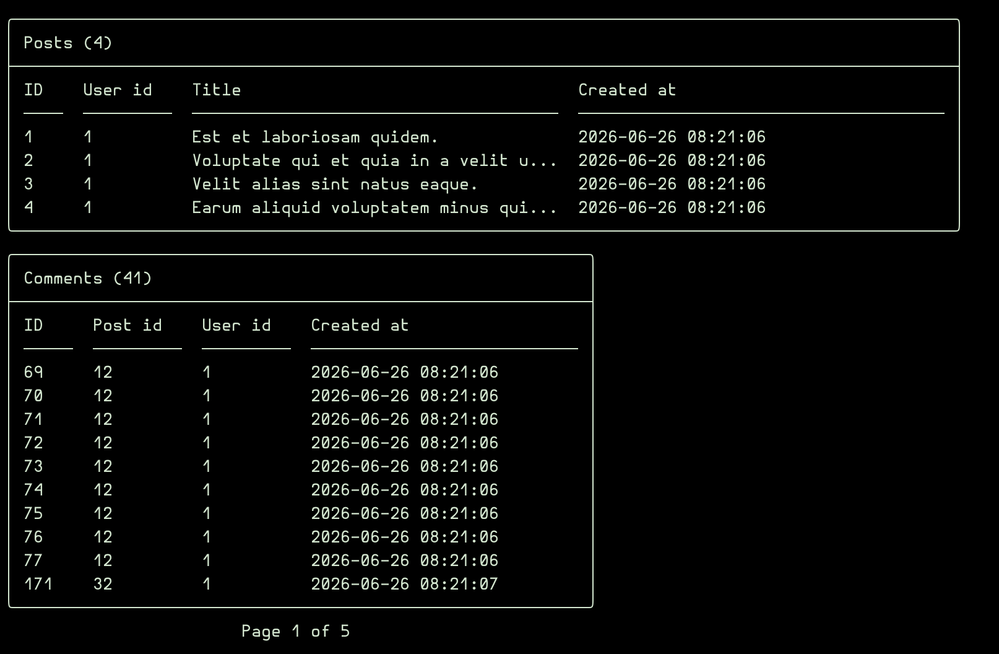
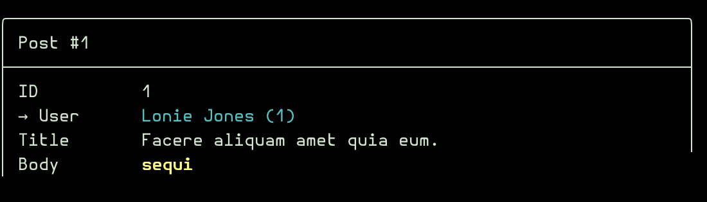

# Relationships

All relation types use the signature `Relation::make(string $label, string $resourceClass)` or `Relation::make(string $label, string $name, string $resourceClass)` where `$label` is the display name, `$name` is the optional relationship method name on the model, and `$resourceClass` is the related resource class. If `$name` is omitted, it will be automatically derived from the label.

## Screenshots

<a href="../img/relationships-screen.png"></a>

<a href="../img/belongs-to-relationships-in-detail-screen.png"></a>

## Fillable (appear in create/edit forms)

- `BelongsTo::make('User', UserResource::class)` or `BelongsTo::make('User', 'user', UserResource::class)` — Belongs to relationship
  - `->displayField('name')` — Column used to display/search options
  - `->required()` — Require a selection (default: optional with a "— None —" option)
  - Uses inline search for large datasets

- `MorphTo::make('Commentable', 'commentable', [PostResource::class])` — Polymorphic BelongsTo
  - `->displayField('title')` — Column used to display/search options
  - `->resources([…])` — Acceptable target resource classes
  - `->required()` — Require a selection

## Inline (displayed in the main detail box)

- `HasOne::make('Profile', ProfileResource::class)` or `HasOne::make('Profile', 'profile', ProfileResource::class)` — Has one relationship
  - Displayed inline in the detail view

- `MorphOne::make('Profile', ProfileResource::class)` or `MorphOne::make('Profile', 'profile', ProfileResource::class)` — Polymorphic Has one relationship
  - Displayed inline in the detail view

## Tabular (displayed as paginated sub-tables below the main box)

- `HasMany::make('Posts', PostResource::class)` or `HasMany::make('Posts', 'posts', PostResource::class)` — Has many relationship
  - Displayed as a paginated sub-table in the detail view

- `HasManyThrough::make('Posts', PostResource::class)` or `HasManyThrough::make('Posts', 'posts', PostResource::class)` — Has many through relationship
  - Displayed as a paginated sub-table in the detail view

- `BelongsToMany::make('Roles', RoleResource::class)` or `BelongsToMany::make('Roles', 'roles', RoleResource::class)` — Belongs to many relationship
  - Displayed as a paginated sub-table in the detail view
  - Pivot column can be accessed via `pivot.column_name` in `tableColumns()`

- `MorphMany::make('Comments', CommentResource::class)` or `MorphMany::make('Comments', 'comments', CommentResource::class)` — Polymorphic Has many relationship
  - Displayed as a paginated sub-table in the detail view

- `MorphToMany::make('Tags', TagResource::class)` or `MorphToMany::make('Tags', 'tags', TagResource::class)` — Polymorphic many to many relationship
  - Displayed as a paginated sub-table in the detail view
  - Pivot column can be accessed via `pivot.column_name` in `tableColumns()`

- `MorphedByMany::make('Teams', TeamResource::class)` or `MorphedByMany::make('Teams', 'teams', TeamResource::class)` — Inverse polymorphic many to many relationship
  - Displayed as a paginated sub-table in the detail view

## Relationship Columns in tableColumns()

Use dot notation in `tableColumns()` to display columns from related models in the list view. Relationships are automatically eager-loaded so no N+1 queries occur.

```php
class PostResource extends Resource
{
    protected static string $model = \App\Models\Post::class;

    public static function fields(): array
    {
        return [
            Text::make('Title')->required(),
            BelongsTo::make('User', 'user', UserResource::class)->displayField('name'),
        ];
    }

    public static function tableColumns(): array
    {
        return ['id', 'title', 'user.name', 'user.email', 'created_at'];
    }
}
```

Column headers render with arrows: `user.name` becomes `User → Name`. Values are resolved through the Eloquent relationship at render time. Dot-notation columns are excluded from sorting since they can't be used in a simple `ORDER BY`.

[← Back to README](../README.md)
