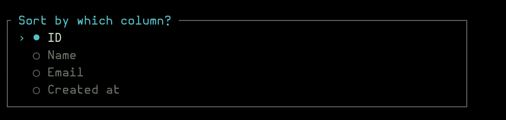

# Resources

Resources are the central concept of cli-crud — they map an Eloquent model to a CLI interface with fields, columns, relations, and actions.

## Creating Resources

Generate a new resource:

```bash
php artisan make:cli-resource User
```

This creates `app/CliCrud/Resources/UserResource.php`:

```php
<?php

namespace App\CliCrud\Resources;

use Repat\CliCrud\Resources\Resource;
use Repat\CliCrud\Fields\Text;
use Repat\CliCrud\Fields\Boolean;
use Repat\CliCrud\Fields\DateTime;
use Repat\CliCrud\Fields\Relations\HasMany;

class UserResource extends Resource
{
    protected static string $model = \App\Models\User::class;
    protected static string $label = 'Users';
    protected static string $singularLabel = 'User';
    protected static ?string $title = 'name';

    public static function fields(): array
    {
        return [
            Text::make('Name')->required(),
            Text::make('Email')->required()->email(),
            Boolean::make('Is Active')->default(true),
            DateTime::make('Email Verified At')->nullable(),
            HasMany::make('Posts', PostResource::class),
        ];
    }

    public static function tableColumns(): array
    {
        return ['id', 'name', 'email', 'is_active', 'created_at'];
    }
}
```

### Properties

| Property | Required | Description |
|----------|----------|-------------|
| `$model` | Yes | FQCN of the Eloquent model |
| `$label` | Yes | Plural display name |
| `$singularLabel` | Yes | Singular display name |
| `$title` | Yes | Column used to identify records in menus and BelongsTo searches |

### Soft Deletes

<a href="../img/deletion-screen.png"></a>

If your model uses the `SoftDeletes` trait, the package automatically:

- Shows a toggle to view trashed records
- Provides "Restore" and "Force Delete" actions for trashed records
- Performs soft delete by default

## Auto-generating fields from a model

Pass the `--model` option to read the database schema and generate fields with correct types:

```bash
php artisan make:cli-resource User --model=\App\Models\User
```

See [FIELDS.md](FIELDS.md) for all field types and options, [SEARCH.md](SEARCH.md) for declaring searchable fields, and [CARDS.md](CARDS.md) for detail-view cards.

<a href="../img/sort-screen.png"></a>

[← Back to README](../README.md)
